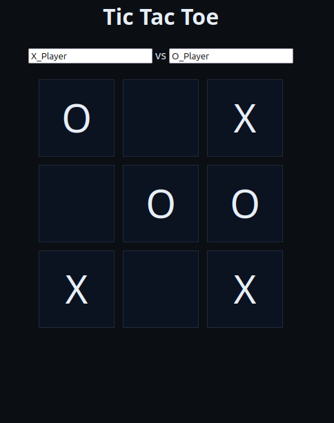

# Tic-Tac-Toe — Kubernetes Home Lab Project

A full-stack **Tic-Tac-Toe web application** deployed on a self-hosted k3s Kubernetes cluster. This project demonstrates a production-aware GitOps workflow using Flux CD, Helm, and SOPS-encrypted secrets.

---

##  Architecture

```
                        ┌─────────────────────────────────────┐
                        │          k3s Home Cluster            │
                        │                                      │
  Browser ──────────▶  │  Traefik Ingress (game.x4.com)       │
                        │         │                            │
                        │         ▼                            │
                        │   [game-web] Flask App :5000         │
                        │         │                            │
                        │         ▼                            │
                        │   [postgres] PostgreSQL 16           │
                        │         │                            │
                        │         ▼                            │
                        │   PersistentVolumeClaim (2Gi)        │
                        └─────────────────────────────────────┘
```




---

##  Tech Stack

| Layer | Technology |
|---|---|
| Application | Python / Flask |
| Database | PostgreSQL 16 (Alpine) |
| Container Orchestration | Kubernetes (k3s) |
| Package Management | Helm 3 |
| GitOps | Flux CD |
| Ingress | Traefik |
| Secrets Management | SOPS + Age |
| Container Registry | Docker Hub |

---

##  Project Structure

```
game/
├── Chart.yaml                  # Chart metadata and versioning
├── values.yaml                 # Default configuration values
├── README.md                   # This file
└── templates/
    ├── deployment.yaml         # Postgres and web app Deployments
    ├── service.yaml            # ClusterIP Services for both workloads
    ├── storage.yaml            # PersistentVolumeClaim for Postgres data
    ├── traefik-ingress.yaml    # Traefik Ingress resource
    ├── secret.yaml             # SOPS-encrypted Kubernetes Secrets
    └── NOTES.txt               # Post-install instructions
```

---

## 🔐 Secrets Management

Secrets are encrypted at rest using **SOPS + Age** and are safe to commit to this repository. Plaintext credentials are never stored in Git.

Flux CD handles automatic decryption at deploy time using an Age private key stored as a Kubernetes secret in the cluster.

### Setting up decryption in Flux

```bash
# Store your Age private key in the cluster
cat age.agekey | kubectl create secret generic sops-age \
  --namespace=flux-system \
  --from-file=age.agekey=/dev/stdin
```

Ensure your Flux `Kustomization` has decryption configured:

```yaml
spec:
  decryption:
    provider: sops
    secretRef:
      name: sops-age
```

### Re-encrypting secrets

```bash
sops --encrypt --age <your-public-key> \
  --encrypted-regex '^(data|stringData)$' \
  templates/secret.yaml > templates/secret.yaml
```

---

## 🚀 Installation

### Prerequisites

- Kubernetes 1.24+ (k3s recommended for home lab)
- Helm 3.x
- Traefik installed as the ingress controller
- Flux CD bootstrapped to the cluster
- SOPS + Age configured (see above)
- A DNS entry or `/etc/hosts` record pointing `game.x4.com` to your cluster IP

### Install with Helm

```bash
# Clone the repo
git clone https://github.com/appoc0014/Dell-Cluster/tree/main/Helm/game
cd <your-repo>

# Install the chart
helm install game ./game \
  --namespace game \
  --create-namespace
```

### Verify the deployment

```bash
kubectl get pods -n game
kubectl get ingress -n game
```

Once both pods show `Running`, the app is available at **http://game.x4.com**

---

##  Configuration

All values are configurable via `values.yaml`.

### Postgres

| Parameter | Description | Default |
|---|---|---|
| `postgres.name` | Deployment and Service name | `postgres` |
| `postgres.image` | Container image | `postgres:16-alpine` |
| `postgres.port` | Database port | `5432` |
| `postgres.pvcName` | PersistentVolumeClaim name | `postgres-pvc` |
| `postgres.storage` | Storage size requested | `2Gi` |

### Web App

| Parameter | Description | Default |
|---|---|---|
| `web.name` | Deployment and Service name | `game-web` |
| `web.image` | Container image | `appoc14/tictactoe-web:1.0` |
| `web.containerPort` | Port the app listens on | `5000` |
| `web.servicePort` | Port exposed by the Service | `80` |
| `web.serviceType` | Kubernetes Service type | `ClusterIP` |

### Ingress

| Parameter | Description | Default |
|---|---|---|
| `ingress.enabled` | Toggle ingress on or off | `true` |
| `ingress.host` | Hostname to route traffic from | `game.x4.com` |
| `ingress.path` | URL path prefix | `/` |
| `ingress.pathType` | Kubernetes path type | `Prefix` |

---

## 🔄 GitOps with Flux CD

This project is managed via **Flux CD** for automated GitOps deployments. Any change pushed to the repository is automatically reconciled to the cluster.

Example `HelmRelease` manifest:

```yaml
apiVersion: helm.toolkit.fluxcd.io/v2beta1
kind: HelmRelease
metadata:
  name: game
  namespace: game
spec:
  interval: 5m
  chart:
    spec:
      chart: ./game
      sourceRef:
        kind: GitRepository
        name: flux-system
        namespace: flux-system
  values:
    ingress:
      host: game.x4.com
```

---

##  Health Checks

Both workloads include readiness and liveness probes to ensure traffic is only routed to healthy pods.

**Postgres** — uses `pg_isready` to verify the database is accepting connections before marking the pod ready.

**Web App** — uses an HTTP GET to `/` to confirm the Flask app is serving requests.

---

##  Uninstall

```bash
helm uninstall game -n game
```

> **Note:** The PersistentVolumeClaim is retained by default to prevent data loss. To fully remove all data:
> ```bash
> kubectl delete pvc postgres-pvc -n game
> ```

---

##  Author

**appoc14** - Marco Gonzalez
Home lab enthusiast | DevOps learner
-  Docker Hub: [appoc14](https://hub.docker.com/u/appoc14)
-  GitHub: [@appoc14](https://github.com/appoc14)

---

*Built with a k3s home cluster, a lot of YAML, and a healthy appreciation for encrypted secrets.*
